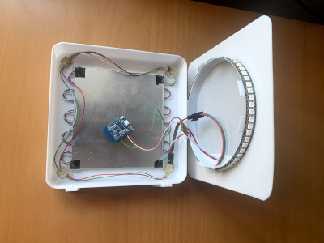
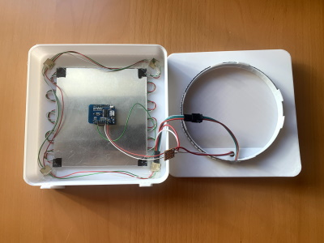
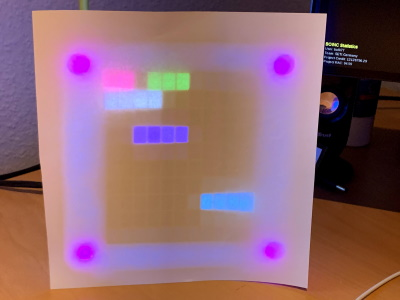
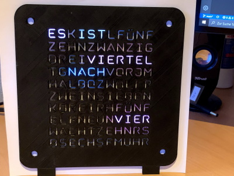

# WordClock

An ESP8266 based Word Clock built with PlatformIO that fetches the time from a NTP server.

This is firmware for the 11x10 LED Matrix word clock case from [WordClock 12h (desk clock edition) from Thingiverse](https://www.thingiverse.com/thing:2130830).

It currently has three modes:

- word clock with seconds as ambilight
- rainbow animation
- aurora borealis animation

The modes and brightness can be set via mqtt by writing to the following mqtt topics:

- `wordclock/brightness/set` (0..255) - very low brighness values (e.g. less than 20) may lead to colors not being shown properly
- `wordclock/mode/set` (0..2)

When the word clock is powered up, it starts in mode 0 (word clock) with brightness 20.
The word clock reports its state via the following mqtt topics:

- `wordclock/$localip` - the ip address assigned to the word clodk
- `wordclock/$mac` - the mac address of the ESP8266
- `wordclock/$state` - (ready|lost). `ready` when connected to wifi and mqtt. The state switches to `lost` automatically, when the connection is lost.
- `wordclock/brightness` - the current brightness
- `wordclock/mode` - the current mode

Dependencies are:

- FastLed
- NtpClient
- Time
- TimeZone
- AsyncMqttClient

If you build the firmware using PlatformIO, all dependencies are pulled in automatically. If you prefer a different IDE you have to take care of everything yourself.

The wifi and mqtt credentials are stored in an external "secrets.h" file.

|  |  |
| :----------------------------------------: | :----------------------------------------: |
|                 Open case                  |                 Open case                  |

The pictures below are taken with almost minimal brightness of the LEDs.

|  |  |  |
| :------------------------------------------: | :------------------------------------------------: | :----------------------------------------: |
|                 No diffusor                  |            A sheet of paper as diffusor            |              Paper and front               |

The case is beautiful, but IMHO it has two drawbacks:

- The grid part for the LEDs should be printed separately in black. Even though I have spray painted the
  inner walls of the grid white twice, there's still a glow effect from one chamber to the next.
- Another reason for the glow effect is probably that it is not possible to bring the LEDs 100% tight to the
  grid. The cables that you have to solder to the ends and the LED strip itself will always account for a
  1mm gap between LEDs and grid, so light can get through. This can perhaps be solved by filing down the
  vertical parts of the grid a bit, but it would be better to make the horizontal parts of the grid a bit
  longer on the rear side.
